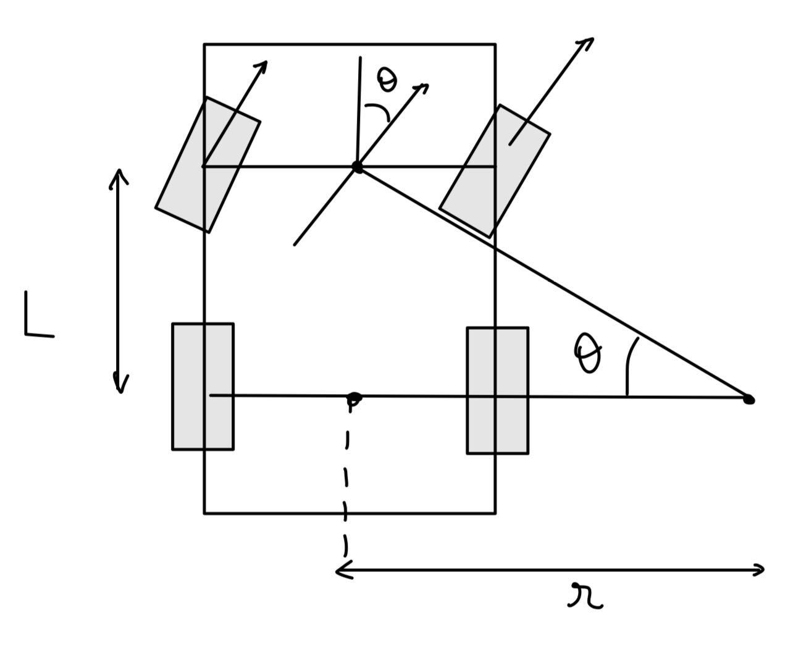

# Drive Transformer node: from Differential to Ackermann Drive

This node subscribes to the topic `/cmd_vel_diff`, which is of type `geometry_msgs.msg.Twist`. It transforms this Differential Drive command into an Ackermann Drive command, and then publishes back a `geometry_msgs.msg.Twist` message on the topic `/cmd_vel`.

## About Usage
Simply launch the node after building the workspace:
```
ros2 run drive_transformer differential_to_ackermann.py
```
It expects to receive Differential Drive commands (`linear.x` and `angular.z`) on the `/cmd_vel_diff` topic and will publish corresponding Ackermann Drive commands (`linear.x` and steering angle `angular.z`) on `/cmd_vel`.


## Theory

The Differential Drive commands are linear and angular velocities, while Ackermann Drive commands are linear velocity and steering angle. Therefore, the steering angle needs to be deduced from the linear and angular velocities.

Let's denote $L$ the distance between front and rear wheels, $r$ the turning radius, and $\theta$ the steering angle. $L$ was set as `self.wheelbase = 0.54838`, from the urdf front and rear wheel joint positions.



The geometric relation drawn above then holds:

$$
r = \frac{L}{\tan(\theta)}
$$

But since the turning radius is linked to the linear and angular velocities by: $v = \omega r$, we get the following equation for finding the steering angle:

$$
\theta = \arctan\left(\frac{L \cdot \omega}{v}\right)
$$

### Special case: pure rotation
In Ackermann drive, pure rotation is physically impossible, because steering-only wheels cannot rotate the car about its center without linear motion. Therefore, a design choice was made when a pure rotation differential drive is sent. In that case, a back and forth movement is performed, where:
- the linear velocity is set to a constant low value, but its direction changes at each new callback of the differential drive subscriber.
- the steering angle is set to $\theta = \arctan\left(\frac{L \cdot \omega}{v_{low}}\right)$, that way the steering is higher when the angular velocity command is higher.
## Demo
This first demo shows the robots motion when a circle motion command is sent, which is in Differential Drive motion when the linear and angular velocities are non zero.

```
ros2 topic pub /cmd_vel_diff geometry_msgs/msg/Twist "{linear: {x: 1.0, y: 0.0, z: 0.0}, angular: {x: 0.0, y: 0.0, z: 1.0}}"
```


This second demo shows the robots motion when a pure rotation command is sent, which is in Differential Drive motion when only the angular velocity is non zero.

```
ros2 topic pub /cmd_vel_diff geometry_msgs/msg/Twist "{linear: {x: 0.0, y: 0.0, z: 0.0}, angular: {x: 0.0, y: 0.0, z: 1.0}}"
```


## Possible Improvements
- Pure rotation behavior limitations:
The current oscillation method (back-and-forth motion) used to simulate pure rotation introduces slight lateral drift and instability.
This is because:
    - The robot moves physically forward and backward instead of rotating on the spot.

    - The resulting rotation speed is lower than expected for high angular velocity commands.
A better solution could involve dynamically adjusting the oscillation frequency or designing a more sophisticated motion model.

- No systemd service installation:
I have no experience with systemd, and due to time constraints I did not understand how to manage automatic node execution inside a Docker container, because Docker is designed to run a single main process, and system services are generally not used in containerized environments.

